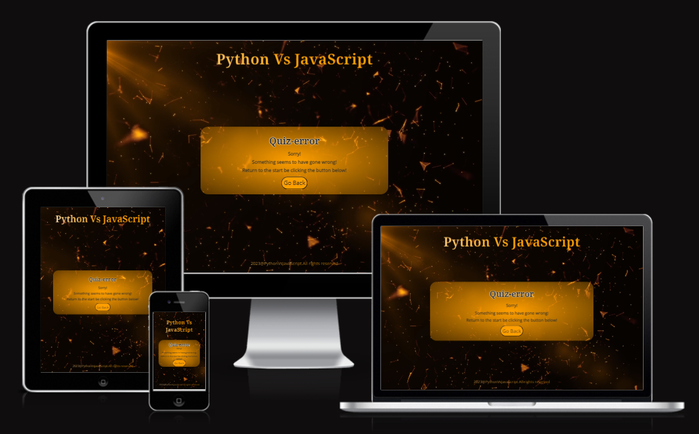

# Python Vs Javascript Quiz

[Link to Live Website](https://sooryageorge7.github.io/Python-Vs-Javascript-Quiz/)

How confident are you in knowing the difference between Python and Javascript ? 

Test your knowledge with this quiz in order to validate your knowledge(Yes, i used the term validate because testing just your website may not be enough!)

The languages Javascript and Python have a lot in common, but also subtle differences.They say that if you know one of them , its easier to learn the other. This statement may be true, but it is also very easy to misplace and confuse code syntax for either of the progamming languages. 

This quiz is aimed to help instill a lot of the differences between the two so that it is easier for user to code when they use either one of the languages in a program. 

The website is especially designed for newbies to coding or the tech world. When learning all the different languages at once, the information may be overwhelming and this quiz is created to help grasp the difference between the two languages in a fun, interactive way.

## CONTENTS

* [User Experience](#User-Experience)
  * [User Stories](#User-Stories)

* [Design](#Design)
  * [Colour Scheme](#Colour-Scheme)
  * [Typography](#Typography)
  * [Imagery](#Imagery)
  * [Wireframes](#Wireframes)
  * [Features](#Features)
    
  * [Future Implementations](#Future-Implementations)
  * [Accessibility](#Accessibility)

* [Technologies Used](#Technologies-Used)
  * [Languages Used](#Languages-Used)
  * [Frameworks, Libraries & Programs Used](#Frameworks,-Libraries-&-Programs-Used)

* [Deployment & Local Development](#Deployment-&-Local-Development)
  * [Deployment](#Deployment)
  * [Local Development](#Local-Development)
    * [How to Fork](#How-to-Fork)
    * [How to Clone](#How-to-Clone)

* [Testing](#Testing)
  * [Solved Bugs](#Solved-Bugs)
  * [Known Bugs](#Known-Bugs)
  
* [Credits](#Credits)
  * [Code Used](#Code-Used)
  * [Content](#Content)
  * [Media](#Media)
  * [Acknowledgments](#Acknowledgments)

---

## User Experience (UX)

### User Stories

#### First Time Visitor Goals

* As a user, I want to know about the game from looking at it so that i can play the game being informed about the content.
* As a user, I want to find out how to play game so that i can play the game efficiently.
* As a user, I want see if my answer is correct so that my score increases.
* As a user, I want to see time limit i have left so that i dont run out of time when playing.
* As a user, I want to see my score at the end so that i can evaaluate if i'm weel versed with Javascript or Python syntax.

#### Returning Visitor Goals

* As a user,I want different questions every time i play to test my knowledge even further.
* As a user,I want to be able to play again if i wanted to so i cant improve my prrevious score.

---

## Design

I wanted to keep the colour scheme to match with background video, and chose few colours to not overwhelm users when playing the game. The main colour which is a yellow-orange color was selected because it's a colour that  creates a sense of excitement and enthusiasm. The background video contains floating particles of a similar shade and it gived the illusion of diving deep into an alternate universe(usually how it feels when you code for hours!)

### Colour Scheme

The colours below are used in the following instances:
* #FF9F00 - Used for button colors,background colours, some texts. This is used as the main color..
* #C1C1C1 - Opted out of not using this in final design because there was no need, and inserting the colour made the area dull.
* #2B2B2B - Used as Primary and secondary text colors and as background color to contrast against the main color(#FF0F00).
* #FAF9F6 - Used as background color for answer buttons
* #226F54 - Used to alert user if answer clicked is correct- turns the button to this color and gives the section border the same shadow.
* #E04C4C - Used to alert user if answer clicked is incorrect- turns the button to this color and gives the section border the same shadow.

### Typography

I used [Google Fonts](https://fonts.google.com/) to import the chosen fonts .

* [Noto Serif](https://fonts.google.com/noto/specimen/Noto+Serif?preview.text=JavaScript%20Vs%20Python&preview.text_type=custom&query=noto+serif&sort=popularity&noto.query=novecento) - Used for All headings and Questions.
* [Open Sans](https://fonts.google.com/specimen/Open+Sans?preview.text=JavaScript%20Vs%20Python&preview.text_type=custom&query=open+sans&sort=popularity&noto.query=novecento) - Used for all other texts in game.

Noto Serif is a serif typeface created by Google specially for users to consume written digital content. I thought it would be appropriate for a quiz game which is educational.
I first got the heading font i wanted from Google fonts and i used [typ.io](https://typ.io/fonts/noto_serif) to get a font that it pairs well with .

### Imagery

I did not use any images , but my background video was chosen it gives the feeling of delving deep into the world of coding and programing languages. The credits for the background video is in [Credits](#credits) section.

### Wireframes

I created wireframes using [Balsamiq](https://balsamiq.com/) for mobile, tablet and desktops screens.

#### Home Page

### Game Page 

### Score Page 

As i developed my game, My design for the game changed because of time constraints and implementations that would be beyond the project 2 scope at this point. 

### Features

The website is comprimised of a home page, game page, score page, how to play page and a 404 error page.

The Home page, Game page, Score page and How to play page are implemented in index.html. Css style display was used to hide and display the certain sections at certain points in the game. 

The 404 error page  is in a seperate html file called 404.html.

All sections in the game have the following in common: 

* The Quiz Heading(Located at top of every section of game.)

* A Copyright statement(Located at the bottom of the page.)

* The favicon (Located on browser tab.)

The different sections in index.html

* Home page 

The home page consists of Quiz heading, A container that gives a short description to user, Buttons that can be clicked on to see how to play the game and to actually play the game . An input area to enter username is also included.

### HOME page

 * The different features of the home page: 
   * A **How to play** Button - Allows user to hover, and click which leads user to How to play page.

   

   * A **Play Button** with username validation -  Allows user to hover and click, but it only starts the game after youve entered a valid username.

   

   * **Username Validation** for charectors(as seen above) and no spaces in between-- Username is validated when the charectors are more than 2 , and there are no blank spaces.

   

---
### GAMES page

 
 * The different features of the game page:
   * A **Score Container** That displays the score, question number, timer and the questions remaining.

   

   * **The questions section** that displays another question every time user answers a question.

   

   * **The Answer buttons** which indicates to the user if the answer clicked is actually correct or incorrect by turning a shade pr red or green. 

   

---
### GAMEOVER page

 
 * The different features of the gameover page:
   * A **No time left** message if you havnt completed all 10 questions within the given time.

   

   * A **performance** section where it shows your score and a display message according to your score. 

   

   * A **Play Again** button where it allows you to play again

   

---
### HOW TO PLAY page

 
 * The different features of the how to play page:
   * A **container** That contains a heading and description on how to play the game.

   

   * A **Go Back** button where it allows user to go back to home page. 

   

---

### 404 page

 
 * The different features of the 404 page:
   * A **container** That contains a heading and description of this page.

   

   * A **Go Back** button where it allows user to go back to home page. 

   

### Future implimentation

* I would implement a database that would allow all users scores and usernames to be stored so that new users would be able to compare their score to previous players. 
* I would implement a pause button, to allow users to stop the game in case of emergencies without having to restart the game again.
* I would want to be able to implement a share button that allows you to share this game to socials or peers. 
* I would add a function to create a tick or a cross for everytime an answer is selected depending on if its correct or wrong. (In case for users with vision imparement such as color blindness.)

### Accessibility

These are the ways i have ensured to provide accessibility to users:

* Used HTML semantics.
* Ensured that user knows when their answer is correct or wrong by using red and green shade to highlight answer.
* Ensure that the user can see the score while playing (this would also help users that maybe color blind).
* Used rem and % for font sizes  throughout website because it can scale up or down according to user's device.
* Ensured Colour Contrast so that the websites are easily readable in light and dark mode.
* Provided alt for video incase images do not load.
* Aria labels were implemented for links and videos.[Learnt you can use aria-labels for videos here](https://www.w3.org/WAI/PF/HTML/wiki/Media_Alt_Technologies)
* Google font "noto serif" was chosen carefully and i chose the pairing to this font "Open Sans" here [Noto serif pairing](https://typ.io/fonts/noto_serif).

## Technologies Used
### Languages Used 

### Frameworks, Libraries & Programs Used

* [Git](https://git-scm.com/) - For version control
* [Github](https://github.com/) - To save and store files for game site.
* [GitPod](https://gitpod.io/) - Code editor.
* [Pexels](https://www.pexels.com/ )- To get free images from open source.
* [Coolors](https://coolors.co/) - To get color palette.
* [sv grepo](https://www.svgrepo.com/) - To find svg icon for favicon and logo.
* [Real Favicon generator](https://coolors.co/) - To generate favicon.
* [Balsamiq](https://balsamiq.com/) - Used to create wireframes of game site.
* [Typ.io](https://typ.io/) - Used to find complimentory font for main heading.
* [Google fonts](https://fonts.google.com/) - Used to get import links for the specific fonts chosen.
* [Font Awesome](https://fontawesome.com/) - Used to get free icons.
* [Tiny PNG](https://tinypng.com/) -  To compress images
* [Birme](https://www.birme.net/) - To change format of image to webp format.
* [Google developer tools](https://developer.chrome.com/docs/devtools/) - Used to test website throughout the process of developing it.
* [Am i responsive](http://ami.responsivedesign.is/) -  To display the quiz game site on a range of devices.

## Deployment & Local Development

### Deployment
To create a live website of Python Vs Javascript Quiz, deployment was done using github pages. The step by step process is shown below:
1. Log in or Sign up to github.
2. Find the repository for this project,Python-Vs-JavaScript Quiz.(Can be found under top repositories on the left hand side)
3. Click on Settings link that is displayed above and left to the green gitpod button.
4. Click on Pages link under code and automation in the navigation bar on the left hand side.
5. Under Build and Deployment, click on the branch drop down menu and select main and make sure the select folder drop down is selected on root.
6. Now click save and wait a few minutes.
7. Refresh the page, and the url for your live website will be shown under the heading, GitHub Pages.
8. Deployment is now complete.

### Local Development
#### How to Fork
To fork the Python-Vs-Javascript-Quiz Repository: 
1. Log in or Sign up to github.
2. Find the repository for this project, SooryaGeorge7/Python-Vs-Javascript-Quiz
3. Click the fork button on top right corner. 
#### How to Clone
To clone the Python-Vs-Javascript-Quiz Repository: 
1. Log in or Sign up to github.
2. Find the repository for this proect, SooryaGeorge7/Python-Vs-Javascript-Quiz.
3. Click on Code button just left to the green gitpod button.
4. Select what you would like to clone with (HTTPS/SSH/GitHub CLI) and copy the link shown below.
5. Open the terminal in your code editor(eg. Gitpod) and change the current working directory to the location you want to use for cloned directory.
6. In the terminal type in "git clone" and paste the link you copied in step 4 above. Press enter.
7. Cloning is now completed.

## Testing

All testing was carried out in [Testing.md](TESTING.md).

### Solved Bugs

| Bug | Solution | 
| :--- | :--- |
| 1. I wanted the answer that the user clicked on to turn green or red depending on if the selected answer was correct or wrong and then the color to return back to the original color after "click" event. - I first tried implementing this using event listner "click" without using any setTimeout(function()), but it did not allow the color to return back to original color. It just remained the red or green color after clicking.[View bug](documentation/gifs/bugs-gif/answer-button-bug.gif) | I first tried to solve this using mouse down, mouse up events and using that to change colours only when mouse is down, and then return to original colour when mouse is up again. Although this method worked fine on desktops, it did not work on mobiles as there is essentially no mouse being click on. This method would not work on touchscreen devices. I tried implementing touchstart and touch end but that triggered really fast response when touching the screen [View bug](documentation/gifs/bugs-gif/touch-start-bug.gif). I then found a function that would allow something to change color for a few seconds here.https://stackoverflow.com/questions/5600351/javascript-change-css-color-for-5-seconds. This method allowed me to use click event and then use if else statement to changed color when clicking to either(red or green) and then i used setTimeout(function()) to change to color back to original color after 1 second. This function allowed the user to click on an answer(which triggered the answer to change color for the 1 second when user clicks )and then to return back to orginal color when the 1 second was up.|
| 2. I wanted to position of the all sections(except header and footer) in the game to be centered on the screen- When using position: relative for this the sections are never at the center of the screen.[View bug](documentation/gifs/bugs-gif/not-centered-bug.gif) | I solved this by changing position to absolute, and adding left:50%;transform: translate(-50%, -50%); top:50%; in css stylesheet to the sections which allowed the main sections of the game to always be centered on any screen.[View final](documentation/gifs/bugs-gif/not-centered-bug-solved.gif) |
| 3. My copyright statement was intially moving with the game section of the game. Have a look here to understand what i mean.[View bug](documentation/gifs/bugs-gif/copyright-bug.gif) | I wanted the copy right statement to always remain at the bottom of the screen so i changed position to fixed, and added left: 50%; transform: translate(-50%, -50%); to achieve the effect of the statement always remaining at the bottom of any screen when playing the game.[View final](documentation/gifs/bugs-gif/copyright-bug-solved.gif) |
| 4. I noticed after deploying that when i click username input field, the heading, sections and copyright statement overlap on my mobile. (only happens on mobile).[View bug](documentation/gifs/bugs-gif/overlap-bug.gif)I tried setting height to sections, margins , paddings, none of which worked. Only when setting the position of sections to relative that there were no overlap, but setting section's position to relative did not create the effect i wanted for my game ( wanting the game to be centered and copyright statement to always remain at the bottom of the screen)I realized none of this would have been a problem if i had not set my background to be a video. I had to set position to sections inorder for my sections to display over my background video.| Then i found a solution here that allowed hiding of other sections using z-index. If i set my main section z-index to 2, and the header and and footer z-index to 1, the the overlapping effect would not be seen by user in smaller screens. [View final](documentation/gifs/bugs-gif/overlap-bug-solved.gif) |
| 5. When initially setting coundown for game i assumed that the timer will automatically end if user finsihes all 10 questions before time was up. The sentence that states "Sorry, You've run out of time" should only appear if user failed to complete all 10 questions in the time given. At this stage , if user was done on the gameover page until the countdown was done. The message automatically popped up. [View Bug Here](documentation/gifs/bugs-gif/countdown-bug.gif)| This was fixed by implementing function clearInterval() which stops the timer as soon as the gameover page is shown. |

### Known Bugs

1. It seems that my background video only works sometimes on iOS devices. After researching, i've found that iphone disables autoplay of videos when on low power mode. In this case, the video just becomes an image instead. 

## Credits

### Code used 

1. I learnt how to shuffle and randomize objects in an array here.- https://sebhastian.com/fisher-yates-shuffle-javascript/ 
2. I learnt how to set a count down for game here. -  https://www.educative.io/answers/how-to-create-a-countdown-timer-using-javascript
3. Learnt how to display a colour for a few seconds here. -https://stackoverflow.com/questions/5600351/javascript-change-css-color-for-5-seconds
4. Learnt to validate username to check for blank spaces here. - https://stackoverflow.com/questions/1133770/how-to-convert-a-string-to-an-integer-in-javascript  https://www.w3schools.com/jsref/jsref_indexof.asp
5. Learnt about radial and linear gradients which is used in css here. https://www.w3schools.com/css/css3_gradients_radial.asp 
6. Learn to do the main quiz heading styling here. https://blog.logrocket.com/five-cool-css-header-styles-with-cross-browser-compatibility/

### Content 

All descriptions in home page, gameover page and how to play page was written by me.
Most questions or statements were written were taken from study material in Code institute's LMS and few from a game i found online https://www.sporcle.com/games/VengerKing/python-or-javascript
### Media 
* [Background game video](https://pixabay.com/videos/particles-plexus-network-glowing-27669/)
### Acknowledgements

