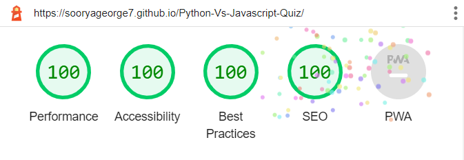
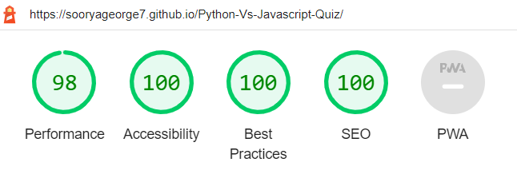
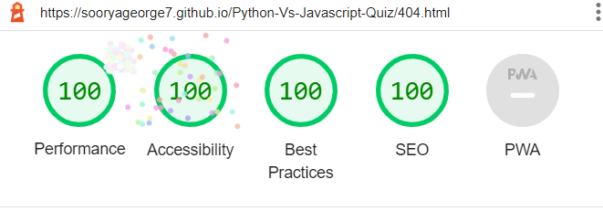
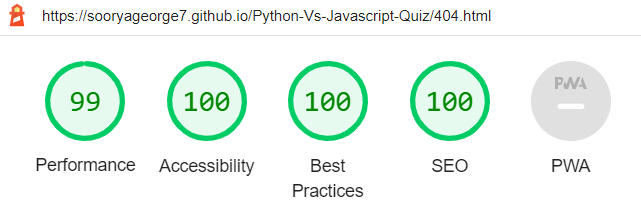
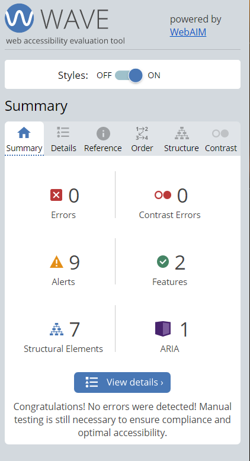

# Python Vs JavaScript Quiz Testing 

[View Live site here](https://sooryageorge7.github.io/Python-Vs-Javascript-Quiz/)

---

## CONTENTS

* [Automated Testing](#Automated-Testing)
  * [W3C Validator](#W3C-Validator)
  * [JavaScript Validator](#JavaScript-Validator)
  * [Lighthouse](#Lighthouse)
  * [Wave Accessibility Test](#Wave)
* [Manual Testing](#Manual-Testing)
  * [Testing User Stories](#Testing-User-Stories)
  * [Full Testing](#Full-Testing)

  ---

I used google developer tools throughout development of game to test different aspects and stages of the game.
I also used the console section in chrome dev tools to test javascript code and also to check and troubleshoot any issues that arise in the code too. 

---

## Automated Testing 

### W3C Validator 

1. [W3C validation for index.html](documentation/tests/final-index.html-validation.png) - Passed
2. [W3C validation for 404.html](documentation/tests/404-html-validation.png) - Passed
3. [Jigsaw W3C Validation for style.css](documentation/tests/final-css-validation.png) 
  *  No errors, 
  * 2 warnings are : -webkit-background-clip is a vendor extension - Ive checked with CI tutor support if this would be a problem and they assured me that it wouldnt be since its a warning. I used that code to have a certain effect on my quiz heading. 

### JavaScript Validator 

1. [Js Hint validation for script.js](documentation/tests/script-javascript-validation.png) 
  * Initially had unused variables howtoPlay, playButton, validateMessage but i realized it was because i used onclick function in html instead of using event listners to call functions in javascript files. I corrected this.
  * Unused variable shown in validator called "questions" is from the questions array in questions.js. I checked with ci tutor support if this was okay, and they assured that i wouldnt lose points for that.
2.  [Js Hint validation for questions.js](documentation/tests/questions-js-validation.png)
  * The unused variable "questions" is used in script.js 

### Lighthouse 

**index.html** 
  * Desktop 
    * Lightmode

    

    * Darkmode

    .png)

  * Mobile
    * Lightmode

    

    * Darkmode

    .png)

**404.html**
  * Desktop
    * Lightmode

    

    * Darkmode

    -404.png)

  * Mobile
    * Lightmode 

    

    * Darkmode

    -404.png)

### Wave

The wave test alerts were for 8 possible headings and 1 X html5 video. 
* The possible headings was not valid in this case as its not a website but a game. 
* The video alert wasnt warrented in this case because its a background video that automatically plays itself, doesnt have audio or subtitles.I have added aria-labels to video in index.html incase video doesnt load or for people with vision impairments.

---

## Manual Testing

### Testing User Stories

**First Time Visitors** 

|First Time User Goals| How this was achieved|
| :--- | :--- |
| As a user, I want to know about the game from looking at it so that i can play the game being informed about the content.|The game is a quiz game about javascript and python which is written as the main heading throughout all sections of the game.The home page also has description for who the game is targetted for.| 
| As a user, I want to find out how to play game so that i can play the game efficiently.|The game has a How to play page which can be seen when you click on **How To Play** button on first page. | 
| As a user, I want see if my answer is correct so that my score increases.|When the user clicks the answer buttons, the button either turns green or red to show the user that the selected answer is either right or wrong, the score can also be seen to increase if user selects right answer. |  
| As a user, I want to see the time i have left so that i can play at enough speed to not run out of time.|The user is able to see the countdown timer as they play | 
| As a user, I want to see my score at the end so that i can evaluate if i'm well versed with Javascript or Python syntax.|At the end of the game , the user is shown their score with a performance message depending on how good or bad they did.|

**Returning Visitors**

|Returning User Goals| How this was achieved|
| :--- | :--- |
| As a user,I want different questions every time i play to test my knowledge even further.| The questions are randomized and drawn out of an array of 30 questions so that questions will not be repeated each time you play.
| As a user,I want to be able to play again if i wanted to so i cant improve my previous score.| After the game the user has the option to click a **Play Again** button which allows user to play again.| 

---
### Full Testing 

Full Testing was performed on these devices and browsers for each section of game :-

**Devices**
1. S20 Ultra
2. iPhone 12 Pro
3. Dell inspiron 3593
4. Lenovo Thinkpad W541

**Browsers**
1. Microsoft Edge	
2. Google Chrome	
3. Mozilla firefox	
4. Safari

`Home Page Section`

|Features|Expected result| Actual result| Pass/Fail | 
| ------ | ------------- | ------------ | --------- |
| Quiz Heading| To appear on top of home page and be of font style noto serif, with linear gradient css style| seen as expected  | pass |
|Copyright Statement| To appear at bottom of screen, centered and in open sans font style with linear gradient css style|  as expected result| pass|
| How To Play Button | *When hovered on-resulting in a white boxshadow   * when clicked on- redirects user to How To Play Page | As expected result | Pass |
|Play Quiz Button | *When hovered on - reslts in a white boxshadow effect   * When Clicked on- if a valid username has been given in input field, the user will be directed to the game page. If no username was placed in input field, it will trigger a validation message just above the button. If username given was inavlid, the playbutton will trigger a validation message as well. | As expected result |  Pass |  
| Input field for username | * When hovered on - the field color changes and the cursor changes to text cursor and a message is shown that says "please fill out this field"   * When clicked on - field color changes back and the field Allows user to type| As expected result except hover effect doesnt work on touch screens | pass |
| Username Validation Message| * Should pop up when user clicks on Play Quiz button without entering anything in input field.   * Should pop up if user enters a username with only 2 charectors or less.  * Should be displayed if user enters username with an blank spaces | As expected result | Pass |

`Game Page Section`

|Features|Expected result| Actual result| Pass/Fail | 
| ------ | ------------- | ------------ | --------- |
| Quiz Heading| To appear on top of screen and be of font style noto serif, with linear gradient css style| seen as expected  | pass |
|Copyright Statement| To appear at bottom of screen, centered and in open sans font style with linear gradient css style|  as expected result| pass|
| Question number feature| The value for feature should increase by 1 everytime an option is selected. | As expected result | Pass |
| Score feature | * The value for score should increase by 1 everytime an answer selected was correct or when answer button turns green   * The value for score should decrease by 1 everytime an answer selected was incorrect or when answer button turns red. | As expected result | pass |
| Count Down Timer | * The countdown should start at 60 seconds at start of game. When it reaches 0 seconds, the game should end and redirect user to Gameover page with display message "sorry you've run out of time"| As expected result | Pass |
| Remaining Questions feature |* When game starts , The value for remaining is 10. Everytime the player moves on to another question the value should decrease by 1 . For the last question, The value for "Remaining" should be 0. | As expected result | Pass |
|Answer Buttons- `Python` and `JavaScript` | * When hovered on - should show user boxshadow effect and text color changing.   * When clicked on - * Should either turn green or red according to if answer is correct or wrong.   *Should promt to show user the next question and allow changes to values of scores, question and remaining. | As expected result except hover effect doesnt work on touchscreens| Pass |
| Questions/Statements | Should be legible and in color #2b2b2b with textshadow #FAF9F6 | As expected result | Pass |

`Gameover Page Section`

|Features|Expected result| Actual result| Pass/Fail | 
| ------ | ------------- | ------------ | --------- |
| Quiz Heading| To appear on top of screen and be of font style noto serif, with linear gradient css style| seen as expected  | pass |
|Copyright Statement| To appear at bottom of screen, centered and in open sans font style with linear gradient css style|  as expected result| pass|
| Statement that appears when you have run out of time | This should appear only when you've run out of time while playing the game and it is shown just below the main heading | As expected result | Pass |
| Gameover heading | Seen as 2nd heading in gameover page after main heading and seen inside the yellow background section. | As expected result | Pass |
| You score displayed out of 10 | Your score should be displayed as "Your score :(Your score)/10"in bold andthis is played directly below Gameover heading. | As expected result | Pass |
| Performance statement | According to your score , the performance statement will be different .* If your score is 10/10 - statement should say "Congraturlations! You really know your stuff (value of username)!"   If score is >= 7 - statement should say "`Well done (value of username)! This is a good score but there is still room for improvement"   If score <7, >5 - statement should say "(value of username), You've just passed but you can definetly do better"  if score is < 5 - then statement should say "Oh no, someone needs to revise their notes!Try again (value of username)? | As expected result | Pass |
| Play Again Button | * When hovered on - should show box shadow effect.   * When clicked on - should redirect user back to home page | As expected result | Pass |

